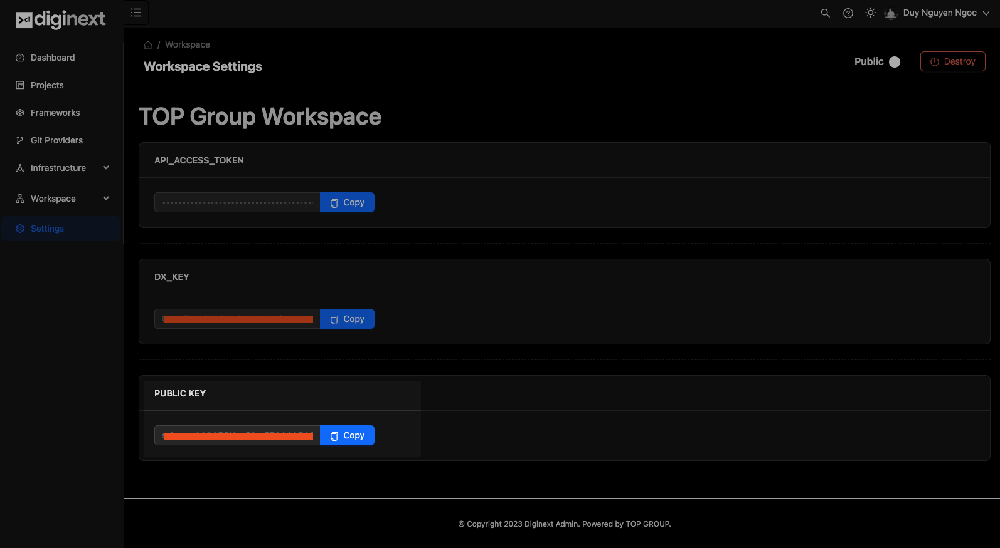

# Development Environment - Initial Setup

When you spin up a new development environment, there will be a couple things you should be aware of:

## Authenticate with your Git Providers

Assuming you are familiar with Git workflow and understand SSH keys, if not, [read here](https://docs.github.com/en/authentication/connecting-to-github-with-ssh/about-ssh). To pull and push to the Git repository, the keys on your machine have to match those in the Git provider's settings. The same applies to Diginext Server. In order to pull your git repositories for building container images, Diginext Server requires access to your repositories via SSH keys.

### 1. Using Diginext Server auto-generated public key

Access Diginext Dashboard and navigate to “Settings” tab, you will see a PUBLIC KEY, copy and add it to your git repository settings.

That’s it, Diginext Server will now has permissions to pull your repositories for building apps.

### 2. Connect git providers with Diginext Server with access token

Diginext only supports Github & Bitbucket integration at the moment, more to come in the future.

**With GITHUB:**

You will need a **Personal Access Token**, grab one by follow [this instruction](https://docs.github.com/en/authentication/keeping-your-account-and-data-secure/managing-your-personal-access-tokens).

Navigate to **“Git Providers”** tab in your workspace dashboard and click on **“Connect”** button, select **“Github”**, finish that authentication steps and you are good to go:

**With Bitbucket:**

You will need **App Password**, create one by follow [this instruction](https://support.atlassian.com/bitbucket-cloud/docs/app-passwords/).

Navigate to **“Git Providers”** tab in your workspace dashboard and click on **“Connect”** button, select **“Bitbucket”**, finish that authentication steps and you are good to go:

