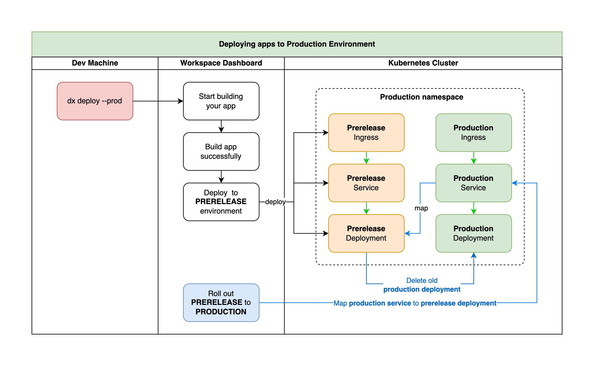

# Deploy Environments

## The tree

- Workspaces
    - Projects
        - Apps
            - Deploy Environments
            - Builds
            - Releases

## Projects & Apps

Some might be confused about these 2 definitions, but if you work with Microservices long enough, you will see this is easy to understand.

For example, one workspace can have many projects, one project can have many child applications, such as: front-end, back-end, API gateway, database, this service, that service, blah blah blah…

Simplify those “micro-services” into projects & apps make it more “developer friendly” and obviously improve `developer experience` (dx)

## Deploy Environments

It is the environment where your apps are deployed to!

### Production environment & the others

When deploying to "other environments", your app will be visible to the public immediately. However, when you deploy to the "production" environment, it will only be visible in the ***"prerelease" environment*** and will only be rolled out to the "production" environment intentionally.

Check out this ***“Blue Green Deployment”*** flow:

*Basically this is what happens when you deploy your app to production environment*

### Prerelease Environment (Preview Environment)

This is the main different of production environment with the other environments, think about it like a **previewed version** of your production app. Take a look at the comparison below:

| Prerelease Environment | Production Environment |
| ---------------------- | ---------------------- |
| • New build            |
• Same Kubernetes cluster
• Same Kubernetes namespace
• Same environment variables 
• Different Kubernetes pods
• Different access URL endpoint | • Old build
• Same Kubernetes cluster
• Same Kubernetes namespace
• Same environment variables 
• Different Kubernetes pods
• Different access URL endpoint |

So basically the `prerelease` environment is the same with `production` environment.

<aside>
👉 **Why?** The purpose of this workflow is to ensure that your "prerelease" app undergoes a full test without any bugs, errors, or typographical issues. Once you have completed this process, you can confidently roll out your app to the public in the "production" environment.

</aside>

### Each deploy environment contains these following information:

1. **Cluster**: the Kubernetes cluster which your app will be deployed to
2. **Namespace**: the namespace in the Kubernetes cluster which your app will be deployed to (most of the time it’s a slug of the parent project, unless you changed it)
3. **Domain**: the domain to access your app (it could be DXUP generated domain or your own domain)
4. **SSL Issuer**: the SSL issuer for your domain (most of the time it should be Let’s Encrypts, unless to change it)
5. **Container Registry**: where you store the container image of your application.
6. **Replicas**: how many instances your app would be scaled to after deployments (on “development” environment, it’s always 1)
7. **Resource Quotas** (I called it “Size” - container size): simply is the amount of resource quotas which your apps can use.
    
    By default, it will be `1x`, equivalent to `50m of CPU and 128MB of RAM`
    Other config would be: `2x, 3x, 4x, … ,10x`
    
8. **Environment Variables**: *(should I need to explain it?)*
    
    This is an array of key pair value, similar to the `dotenv` file you have within your project.
    
9. **Volumes:** a persistent volume of your apps, where you can persist your data (such as user uploaded files).

## Builds

Builds in DXUP are similar to the container images of your app, just with some additional metadata information of the source code, build date, build environment and the author.

### Statuses

- Start
- Building
- Success
- Failed

## Releases

When the builds are success, it will be converted to Releases before deploying.

So Releases are quite similar to builds, with some additional information such as:

- Roll out time
- Author of the release
- The generated Kubernetes YAML files

Think of it like a snapshot of your app’s deployment, so when you want to roll back to any versions, you only need to select one release and roll it out.

### Lifecycle

- Undeployed
- Deploying
- Healthy
- Partial healthy
- Failed
- Crashed
- Unknown