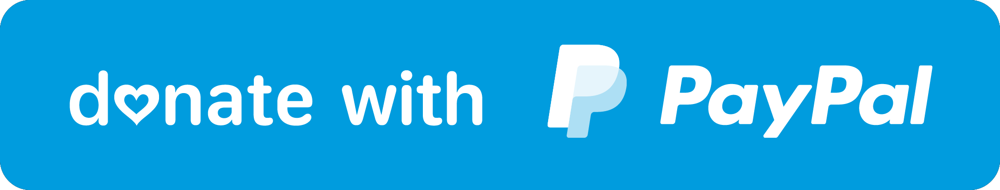

# FAQ

Here are the frequently asked questions about **Diginext (DX)** that you should look up before you ask in the community or create a new issue. 

---

## Should I install Diginext Server on the same cluster with our apps?

**NOT RECOMMEND.** Building apps is the process that sometime requires a lot of machine’s resources, especially the complex ones, if this happens, it would cause interuption of the other apps/deployments.

## Can I use internal APIs/commands which is not documented on the site?

**NOT RECOMMEND.** Internal API/command is not guaranteed to be compatible with future versions. It might be unstable, buggy and break your deploy environments. It may be removed or changed in some versions. If you really need to use it, you should to make sure these APIs/commands are still valid when upgrading to a new version or just lock version for usage.

## Why API/commands request should be strict discussion?

We are cautious when adding APIs/commands because some APIs/commands may not be abstract enough to become historical debt. For example, when there is a need to change the way of interaction, these poor abstractions may cause breaking changes. To avoid such problems, we recommend that new features be implemented through higher order APIs/commands first.

## How to avoid breaking change when update version?

`dx` will avoid breaking change in minor & patch version. You can safe do follow things:

- Official demo usage
- FAQ suggestion. Including codesandbox sample, marked as FAQ issue

And which you should avoid to do:

- Bug as feature. It will break in any other cases.

## How to spell Diginext (DX) correctly?

- ✅  **Diginext**: Capitalized first character, for the identification name.
- ✅  **DX** or **dx**: for the CLI name, and the top priority mission of it - `Developer Experience`.

Here are some typical wrong examples:

- ❌  DigiNext
- ❌  Digi Next
- ❌  digi next
- ❌  DigiX
- ❌  next cli
- ❌  dx cli

## Do you guys have any channel or website for submitting monetary donations, like through PayPal or Alipay?

This is a **ONE-MAN** project & I've been spending a lot of time for it, although it's my hobby project, I still need beers to keep the momentum.

If you enjoyed this project — or just feeling generous, consider buying me some beers. Cheers! 🍻

Thank you!